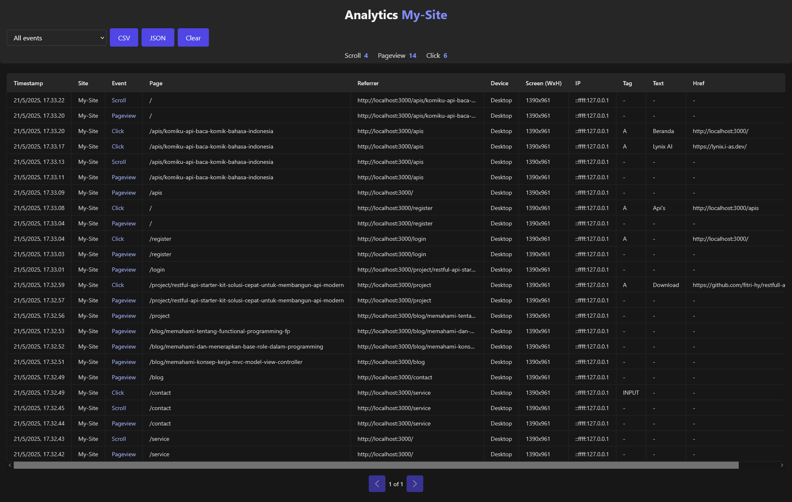

# Tracker Events API

Simple application to track events from multiple sites using two storage options: Local JSON file or MySQL database. Supports event logging, filters, download logs and analytics pages.

---

## Key Features

- Event tracking via pixel GIF
- Save data to local JSON file or MySQL
- Analytics page to view event data
- API to download logs, clear logs per site or clear all logs
- Filter logs by event and device
- Centralized configuration

---

## Project Structure

```

tracker-events-api/
├── app.js
├── config/
│   └── setting.js
├── controllers/
│   ├── analyticsController.js
│   ├── clearController.js
│   ├── downloadController.js
│   ├── filterController.js
│   └── trackController.js
├── logs/
│   └── events.json
├── public/
│   └── track.js
├── routes/
│   ├── web.js
│   └── api.js
├── views/
│   └── analytics.ejs
├── package.json
└── README.md

````

---

## Setup & Installation

1. Clone this repo:

```bash
git clone https://github.com/fitri-hy/tracker-events-api.git
cd tracker-events-api
npm install
npm start
````

3. Configure `config/setting.js`:

```js
module.exports = {
  port: 3000,
  useJson: true,
  logsDir: path.join(__dirname, "../", "logs"),
  logFile: path.join(__dirname, "../", "logs", "events.json"),
  dbConfig: {
    host: "mysql_host",
    user: "mysql_user",
    password: "mysql_password",
    database: "mysql_name_database",
  },
};
```

4. If using MySQL, make sure the database and `logs` table exist:

```sql
CREATE TABLE `logs` (
  `id` int(11) NOT NULL AUTO_INCREMENT,
  `ip` varchar(45) NOT NULL,
  `timestamp` datetime NOT NULL,
  `site` varchar(255) NOT NULL,
  `event` varchar(255) DEFAULT NULL,
  `device` varchar(255) DEFAULT NULL,
  `data` longtext,
  PRIMARY KEY (`id`)
);
```

> Or you can import the database that I have provided in `config/tracker_events.sql.example.example`. Before importing, rename it to `tracker_events.sql`

---

## Client Side Usage

To connect the tracking pixel to your site, use a configuration variable that must be inserted from the server into your site's pages.

1. Insert this global variable into the `<head>` of your site:

```html
<script>
  window.TRACK_SITE = "your-site-name";
</script>
<script src="http://localhost:3000/track.js" defer></script>
```

> Naming must not use spaces and symbols

2. Open and watch `public/track.js`:

```js
  const TRACK_ENDPOINT = "http://localhost:3000";
```

> Make sure each Endpoint goes to the server side.
---

## API Endpoints

| Endpoint         | Method | Description                                             |
| ---------------- | ------ | ------------------------------------------------------- |
| `/analytics`     | GET    | Analytics page, query param: `site`                     |
| `/api/track.gif` | GET    | Tracking pixel receives event data                      |
| `/api/download`  | GET    | Download JSON log, query param: `site`                  |
| `/api/clear`     | GET    | Delete logs by `site`                                   |
| `/api/clear-all` | GET    | Delete all logs                                         |
| `/api/filter`    | GET    | Filter logs based on query params `event` and `device`  |

---

